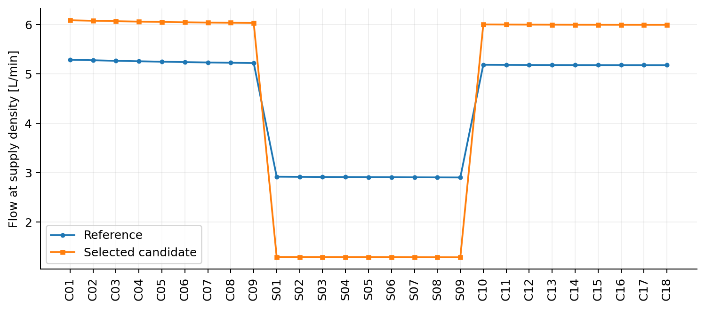
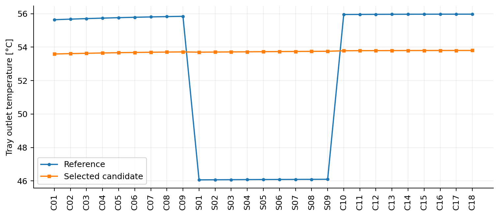
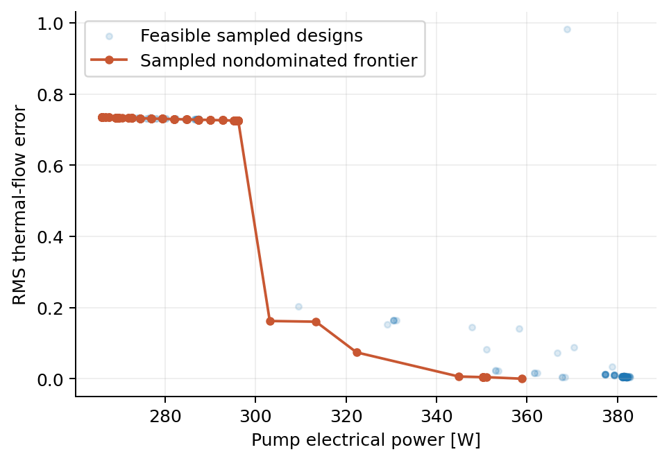
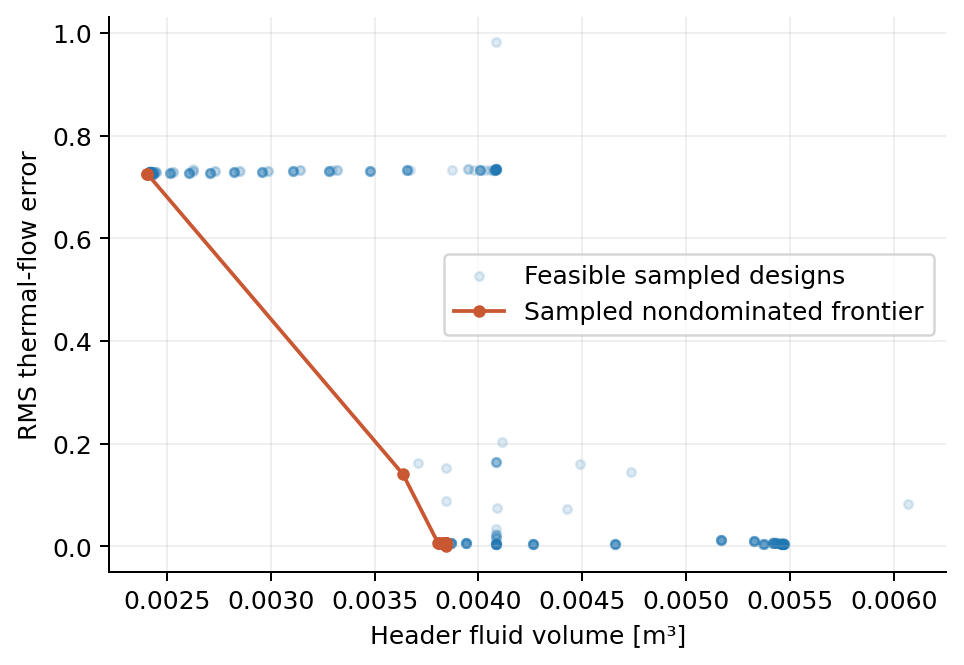
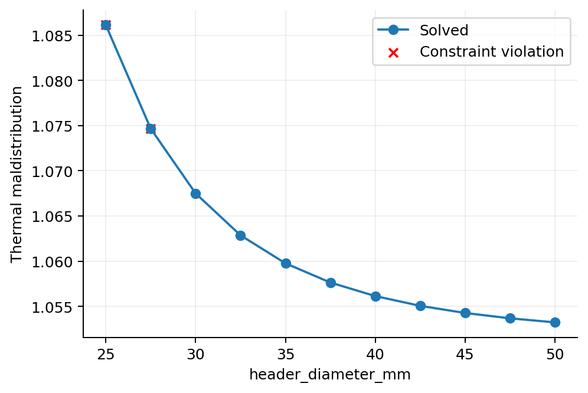
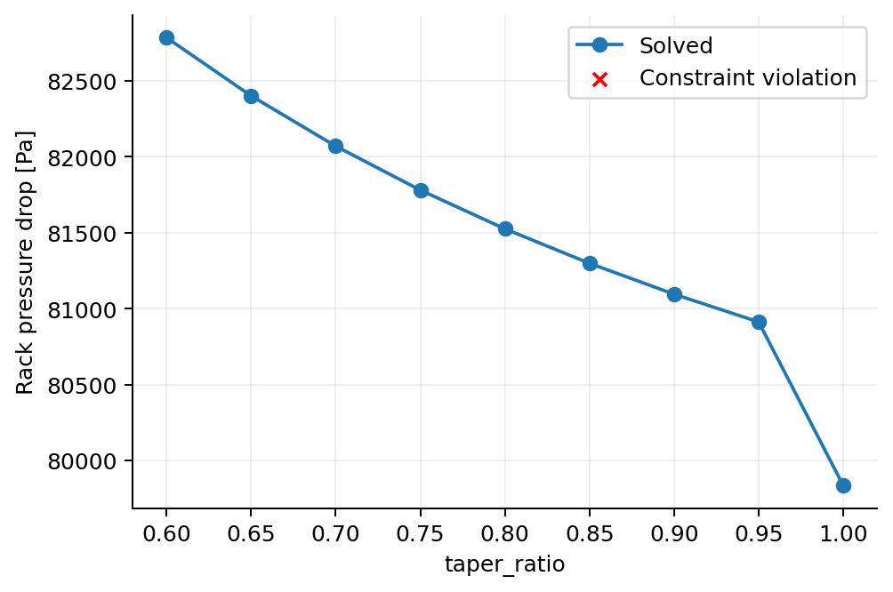
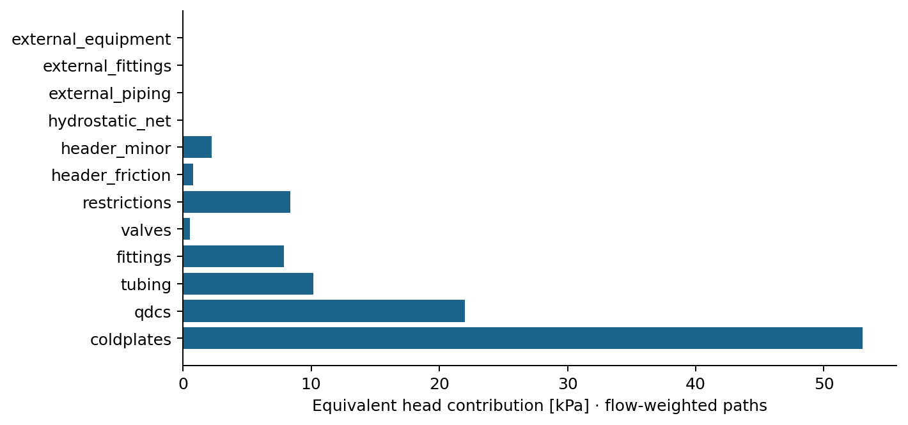

# NVL72-class manifold engineering study

Under the modeled 115.56 kW primary liquid load, the constant 38 mm reference headers at 120.00 LPM give 73.49% RMS heat-proportional flow error and 55.970°C maximum tray outlet. The preferred constant-header two-class candidate at 120.000 LPM gives 0.442% error and 53.799°C maximum outlet. This is a 99.40% error reduction and 2.171 K peak-outlet reduction.

This improvement costs pressure and energy: 79.834 → 105.092 kPa and 266.11 → 350.31 W modeled electrical pump power. The candidate passes the nominal configured CDU screen with 9.908 kPa external head reserve. It is a nominal thermal-distribution improvement, not an unconditional energy or robustness improvement.

# Configuration and source data

Full resolved inputs are in `baseline.json` and `optimized.json`. Additional source checks and remaining data gaps are recorded in `docs/public_source_followup.md`. `agent.md` is retained unchanged. `data/sources.yaml` records every baseline input, evidence category, source URLs, conflicting envelopes and estimates. The 115.56 kW reference is derived from NVIDIA component power budgets; the 102 kW nominal and 115 kW OEM cases are evaluated separately. Primary silicon power is assumed fully captured by liquid.

# Assumptions and baseline architecture

The baseline has 27 branches (C01–C18, S01–S09), assumed elevations over 1.8 m, two constant 38 mm headers and class-specific estimated cold-plate/QDC losses. Branch dimensions, resistance coefficients and minor losses are not proprietary NVIDIA data. All rack branches are solved simultaneously. The source's illustrative omission of C09 is corrected.

# Hydraulic and thermal equations

Each direct-return loop satisfies `H = branch loss + cumulative supply loss + cumulative return loss + cumulative (rho_supply-rho_return) g dz`. Supply and return segment mass flows follow exact continuity. Darcy–Weisbach uses local rho and mu with laminar/Haaland friction; configured fittings add K rho V²/2. Enthalpy integration conserves branch heat and return mixing with variable cp. The return mixes from top to bottom. Supply heat gain is neglected.

# CDU model and facility-loop compatibility

The CDU121 screen uses 121 kW at 4 K approach, 120 LPM and 115 kPa external head. A quadratic pump curve passes through that rated point and an assumed 160 kPa shutoff. The 120 LPM rating is conservatively used as an aggregate flow screen; QCT's 130 LPM rack envelope remains a separate constraint. Required electrical power excludes CDU internal losses and controls. FWS is water at 36°C and 150 LPM; the candidate TCS return is 53.726°C. HX screening and pinch margins are listed in the detailed report.

# Baseline versus optimized results

| Metric | Baseline | Candidate | Candidate − baseline |
| --- | --- | --- | --- |
| Maximum tray outlet [°C] | 55.97 | 53.7994 | -2.17059 |
| Outlet spread [K] | 9.90493 | 0.210358 | -9.69457 |
| RMS thermal-flow error | 0.734916 | 0.00441697 | -0.730499 |
| Maximum target-flow error | 1.2653 | 0.0101262 | -1.25517 |
| Rack pressure drop [Pa] | 79833.9 | 105092 | +25258.5 |
| System pressure drop [Pa] | 79833.9 | 105092 | +25258.5 |
| Rack flow [L/min] | 120 | 120 | +0 |
| Pump hydraulic power [W] | 159.668 | 210.185 | +50.5171 |
| Pump electrical power [W] | 266.113 | 350.308 | +84.1952 |
| Header volume [m³] | 0.00408281 | 0.00408281 | +0 |
| Minimum normalized constraint margin | 0 | 0 | +0 |





# Physical explanation

The switch heat load is only 1.24/5.8 of the compute heat, but its baseline hydraulic resistance does not produce the required 4.68:1 compute/switch mass-flow ratio. Switches are overfed and compute trays underfed relative to equal coolant rise. Added switch restriction redistributes flow to compute trays, raising required head. Larger/tapered headers adjust smaller position-dependent errors; they cannot alone correct this load mismatch. Raw flow CV increases as thermal allocation improves, which is expected for unequal loads.

# Design comparison and practical selection
| Design | RMS error % | Max outlet °C | Head kPa | Pump W | Header L | Nominal feasible |
| --- | --- | --- | --- | --- | --- | --- |
| baseline | 73.49160 | 55.970 | 79.834 | 266.11 | 4.083 | True |
| D | 0.61755 | 53.831 | 114.461 | 381.52 | 3.843 | True |
| A | 72.89010 | 56.169 | 86.209 | 287.36 | 2.416 | True |
| B | 72.54489 | 56.285 | 88.853 | 296.18 | 2.406 | True |
| C | 0.44170 | 53.799 | 105.092 | 350.31 | 4.083 | True |
| E | 0.00000 | 53.727 | 107.673 | 358.89 | 3.843 | True |
| D116 | 0.62069 | 54.307 | 107.046 | 344.93 | 3.843 | True |

Design A optimizes one constant diameter; B optimizes the two header tapers; C uses two restriction classes with fixed baseline headers; D combines geometry, restrictions and flow. E uses the minimum-head nonnegative location restrictions for exact targets at D geometry, verified by the full solver. It is not a global geometry optimum.

The preferred two-class C design's simplification penalty relative to E is 0.0722 K maximum outlet and 0.4417 percentage points RMS error. E requires many distinct restriction settings. C is preferred over the searched D because it uses simpler constant headers and achieves lower thermal error and pump power, at the cost of slightly more header volume. The low-flow D116 alternative increases head reserve but raises coolant temperature. These alternatives are shown separately rather than combined into a misleading single ranking score.

## Selected candidate geometry and restrictions
```yaml
geometry:
  height_m: 1.8
  roughness_m: 1.5e-06
  supply:
    profile: constant
    inlet_m: 0.038
    outlet_m: 0.038
    exponent: 1.0
    pieces_m:
    - 0.038
    - 0.032
    - 0.025
  return:
    profile: constant
    inlet_m: 0.038
    outlet_m: 0.038
    exponent: 1.0
    pieces_m:
    - 0.025
    - 0.032
    - 0.038
branches:
  compute:
    diameter_m: 0.008
    tube_length_m: 1.5
    tube_multiplier: 1.0
    coldplate_K: 5500000.0
    qdc_K: 2300000.0
    restriction_K: 0.0
  switch:
    diameter_m: 0.006
    tube_length_m: 1.0
    tube_multiplier: 1.0
    coldplate_K: 20000000.0
    qdc_K: 5000000.0
    restriction_K: 180528785.87842363
  overrides: {}
```

# Parameter sweeps and Pareto analysis

Six deterministic sweeps are saved in sweeps.csv. The following are sampled nondominated fronts among feasible optimizer evaluations; no claim of a complete mathematical Pareto frontier is made.









# Pressure-drop breakdown

Detailed flow-weighted path budgets are in baseline_pressure_budget.csv and optimized_pressure_budget.csv. GF_reference_comparison.csv compares relative fractions with the 232 kPa broader technical-loop example. Differences are retained; this is not forced calibration of unmeasured tray curves.



# Uncertainty analysis

Paired seeded draws vary class cold-plate/QDC/tubing/restriction coefficients, individual cold-plate scatter, loads, supply temperature, rack flow, fluid (water/PG25), PG model viscosity, roughness and pump efficiency. FWS temperature tracks TCS by 4 K for this study; an independently warmed FWS is tested in the fault study. Extrema below include infeasible solved points. Draws above the conservative 120 LPM CDU rating can fail by construction. These rates are stress-test results, not measured failure probabilities.
| Design | Draws | Feasible | Outlet range °C | Worst head kPa | Worst RMS error % | Solver failures |
| --- | --- | --- | --- | --- | --- | --- |
| baseline | 32 | 50.0% | 38.22–61.99 | 101.48 | 93.15 | 0 |
| C | 32 | 50.0% | 36.64–61.68 | 130.19 | 20.35 | 0 |
| D | 32 | 50.0% | 36.61–61.50 | 138.85 | 20.01 | 0 |
| E | 32 | 50.0% | 36.63–61.64 | 132.77 | 20.30 | 0 |

Hardware-only uncertainty holds each design at its own nominal flow, fluid, load and temperatures, varying hydraulic coefficients, roughness, model viscosity and pump efficiency. This separates resistance sensitivity from deliberate operating-envelope excursions.
| Design | Feasible draws | Worst head kPa | Worst outlet °C |
| --- | --- | --- | --- |
| baseline | 100.0% | 91.68 | 56.50 |
| C | 84.4% | 118.81 | 55.32 |
| D | 59.4% | 130.20 | 55.18 |
| E | 78.1% | 121.78 | 55.29 |
| D116 | 87.5% | 121.73 | 55.69 |

A nominally balanced restriction pattern cannot maintain heat-proportional flow under every changed workload. Designs with little nominal head reserve are sensitive to unknown component losses. No design is declared deployment-qualified or robust across the full uncertainty box.

# Workloads and faults
| Design | Scenario | Max outlet °C | Head kPa | Feasible | Failures |
| --- | --- | --- | --- | --- | --- |
| baseline | full | 55.97 | 79.83 | True |  |
| baseline | compute75 | 51.98 | 79.90 | True |  |
| baseline | compute50 | 47.99 | 79.96 | True |  |
| baseline | nonuniform | 55.96 | 79.91 | True |  |
| baseline | switch_heavy | 55.97 | 79.83 | True |  |
| baseline | near_zero | 55.97 | 79.85 | True |  |
| baseline | blocked | 65.24 | 82.59 | False | branch_outlet, minimum_thermal_flow |
| baseline | degraded_qdc | 57.32 | 80.53 | True |  |
| baseline | double_resistance | 59.41 | 81.23 | True |  |
| baseline | compute_removed | 55.27 | 86.90 | True |  |
| baseline | switch_removed | 55.58 | 83.60 | True |  |
| baseline | pump_reduced | 57.65 | 65.56 | False | HX_capacity |
| baseline | pump_unavailable | 61.76 | 43.38 | False | HX_capacity |
| baseline | warm_coolant | 60.99 | 79.20 | True |  |
| baseline | warm_facility | 55.97 | 79.83 | False | HX_capacity, HX_approach |
| baseline | nominal102 | 54.10 | 79.87 | True |  |
| baseline | OEM115 | 55.89 | 79.84 | True |  |
| C | full | 53.80 | 105.09 | True |  |
| C | compute75 | 53.74 | 105.18 | True |  |
| C | compute50 | 53.74 | 105.26 | True |  |
| C | nonuniform | 53.79 | 105.19 | True |  |
| C | switch_heavy | 56.50 | 105.10 | True |  |
| C | near_zero | 53.80 | 105.11 | True |  |
| C | blocked | 61.90 | 109.31 | True |  |
| C | degraded_qdc | 55.05 | 106.16 | True |  |
| C | double_resistance | 56.85 | 107.23 | True |  |
| C | compute_removed | 53.10 | 116.12 | False | CDU_external_head, pump_curve |
| C | switch_removed | 53.65 | 107.26 | True |  |
| C | pump_reduced | 56.74 | 71.80 | False | HX_capacity |
| C | pump_unavailable | 60.65 | 47.48 | False | HX_capacity |
| C | warm_coolant | 58.81 | 104.32 | True |  |
| C | warm_facility | 53.80 | 105.09 | False | HX_capacity, HX_approach |
| C | nominal102 | 52.18 | 105.13 | True |  |
| C | OEM115 | 53.73 | 105.09 | True |  |
| D116 | full | 54.31 | 107.05 | True |  |
| D116 | compute75 | 54.22 | 107.13 | True |  |
| D116 | compute50 | 54.22 | 107.21 | True |  |
| D116 | nonuniform | 54.30 | 107.14 | True |  |
| D116 | switch_heavy | 57.08 | 107.05 | False | HX_capacity |
| D116 | near_zero | 54.31 | 107.07 | True |  |
| D116 | blocked | 62.03 | 111.19 | True |  |
| D116 | degraded_qdc | 55.40 | 108.07 | True |  |
| D116 | double_resistance | 57.13 | 109.11 | True |  |
| D116 | compute_removed | 53.58 | 118.23 | False | CDU_external_head, pump_curve |
| D116 | switch_removed | 54.15 | 109.22 | True |  |
| D116 | pump_reduced | 57.29 | 73.61 | False | HX_capacity |
| D116 | pump_unavailable | 61.33 | 48.67 | False | HX_capacity |
| D116 | warm_coolant | 59.32 | 106.28 | True |  |
| D116 | warm_facility | 54.31 | 107.05 | False | HX_capacity, HX_approach |
| D116 | nominal102 | 52.63 | 107.08 | True |  |
| D116 | OEM115 | 54.24 | 107.05 | True |  |

Pump-unavailable uses an explicitly assumed equivalent speed reduction, not a measured redundant-pump curve. Removed trays close the hydraulic path and remove its heat, preserving other elevations.

# Gravity study
| Design | Head gravity Pa | Head no gravity Pa | Maximum branch flow change LPM |
| --- | --- | --- | --- |
| baseline | 79833.855 | 79771.013 | 0.002174 |
| D | 114461.129 | 114398.288 | 0.001610 |

The isothermal analytical test cancels hydrostatic head exactly. Heated runs retain a small positive supply-minus-return density term; its distribution effect is small for this configuration.

# Constraint margins
| Constraint | Margin | Units | Pass |
| --- | --- | --- | --- |
| CDU_external_head | 9907.6 | Pa | True |
| pump_curve | 9907.6 | Pa | True |
| rack_flow | 10 | LPM | True |
| CDU_aggregate_flow | 0 | LPM | True |
| supply_temperature | 5 | K | True |
| return_temperature | 11.2736 | K | True |
| branch_outlet | 11.2006 | K | True |
| minimum_thermal_flow | 0.00984778 | kg/s | True |
| header_velocity | 1.22456 | m/s | True |
| minimum_diameter | 0.023 | m | True |
| maximum_diameter | 0.012 | m | True |
| HX_capacity | 5440 | W | True |
| HX_approach | 0 | K | True |
| HX_hot_pinch | 6.59429 | K | True |
| FWS_return | 12.8679 | K | True |

# Validation and optimization termination
| Check | Baseline | Candidate |
| --- | --- | --- |
| mass_relative_error | 0.0 | 2.1769078914218755e-16 |
| energy_relative_error | 2.392578654715907e-15 | 1.5111023082416253e-15 |
| pressure_residual_Pa | 4.3655745685100555e-11 | 4.3655745685100555e-11 |
| property_iterations | 11 | 12 |
| nfev | 377 | 471 |
| temperature_error_K | 7.143992797864485e-05 | 4.653288641520703e-05 |
| flow_relative_error | 3.030256705246463e-08 | 8.251098147386402e-09 |
| converged | True | True |

```json
{
  "A": {
    "design": "A",
    "method": "local",
    "seed": 72,
    "local_success": true,
    "local_message": "Optimization terminated successfully",
    "global_status": null,
    "evaluations": 87,
    "failed_evaluations": 0,
    "selection": "lowest objective among actually solved feasible candidates; not proof of global optimality"
  },
  "B": {
    "design": "B",
    "method": "local",
    "seed": 72,
    "local_success": false,
    "local_message": "Iteration limit reached",
    "global_status": null,
    "evaluations": 244,
    "failed_evaluations": 0,
    "selection": "lowest objective among actually solved feasible candidates; not proof of global optimality"
  },
  "C": {
    "design": "C",
    "method": "local",
    "seed": 72,
    "local_success": true,
    "local_message": "Optimization terminated successfully",
    "global_status": null,
    "evaluations": 25,
    "failed_evaluations": 0,
    "selection": "lowest objective among actually solved feasible candidates; not proof of global optimality"
  },
  "D": {
    "design": "D",
    "method": "global",
    "seed": 72,
    "local_success": true,
    "local_message": "Optimization terminated successfully",
    "global_status": {
      "success": false,
      "message": "Maximum number of iterations has been exceeded.",
      "nfev": 315
    },
    "evaluations": 490,
    "failed_evaluations": 0,
    "selection": "lowest objective among actually solved feasible candidates; not proof of global optimality"
  },
  "E": {
    "design": "E",
    "method": "analytical nonnegative restriction sizing; coupled solver verification",
    "local_success": true,
    "selection": "Minimum head for exact target flows at the supplied fixed geometry, not global geometry optimum"
  }
}
```

# Limitations
This is an NVL72-class engineering model, not a reverse-engineered NVIDIA rack. Exact header dimensions/taper, cold-plate pressure curves, QDC Cv, internal tray plumbing, liquid heat-capture fraction, workload and installed pump curves are unavailable here. Component losses and PG25 property extensions require measurements for design qualification.

The header is a one-dimensional dissipative static-pressure network. It includes Darcy and configured junction losses but neglects recoverable axial kinetic-head redistribution and three-dimensional tee momentum effects. Diameter profiles are discretized into one segment per branch. Headers are adiabatic. Branch reduced K is fixed versus mass flow; viscosity dependence enters resolved tubing/headers, not an unmeasured cold-plate curve. This limitation is included in resistance uncertainty.

Resolved fluid volume includes headers and configured branch tubes; unmeasured QDC and reduced-model cold-plate inventory is excluded. Pressures are relative to the CDU return, not absolute pressure. No cavitation, boiling, transient control, corrosion or structural qualification is inferred. Final return mixing uses enthalpy. Flow in L/min is referenced to supply density; local return volume flow differs. The pressure budget is the mass-flow-weighted equivalent of complete branch paths, including signed buoyancy head, not a sum of parallel pressure drops. Pump power uses inlet volume flow and ignores small thermal expansion corrections and internal CDU overhead. Rated CDU power is separately recorded.

The pump parabola uses one published rating and an assumed shutoff; it is not a measured manufacturer curve. Fixed-flow operation assumes speed control/throttling is available. The HX screen derates its nominal capacity with approach and TCS heat-capacity rate and checks both terminal pinches and facility heat balance; this is not a vendor UA/performance map. XDU1350 is represented by identical parallel racks, not a solved row distribution network. Its temperature range is conservatively checked at both secondary ends.

The optional channel model predicts an equivalent tray-level chip temperature using assumed area and resistances, not 72 individual GPU temperatures. Local optimization success and global iteration-budget termination are reported separately; a feasible candidate is not a certified global optimum. Monte Carlo extrema cover the sampled parameter range only, and the assumed uniform distributions are not measured reliability probabilities.

# Conclusions

The calculated two-class balancing design strongly improves thermal allocation relative to the specified reference. The price is greater hydraulic resistance and pumping demand. A 27-location balance yields only a small additional temperature benefit at nominal load; its parts complexity needs justification. Physical component measurements, PG25 property qualification, a manufacturer pump/HX map and selected operating reserve are the next inputs needed before hardware decisions.
