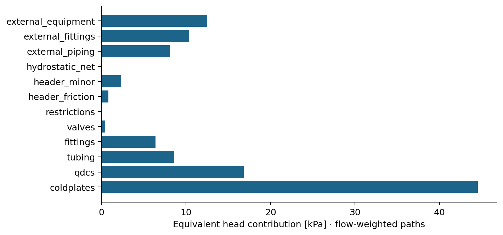
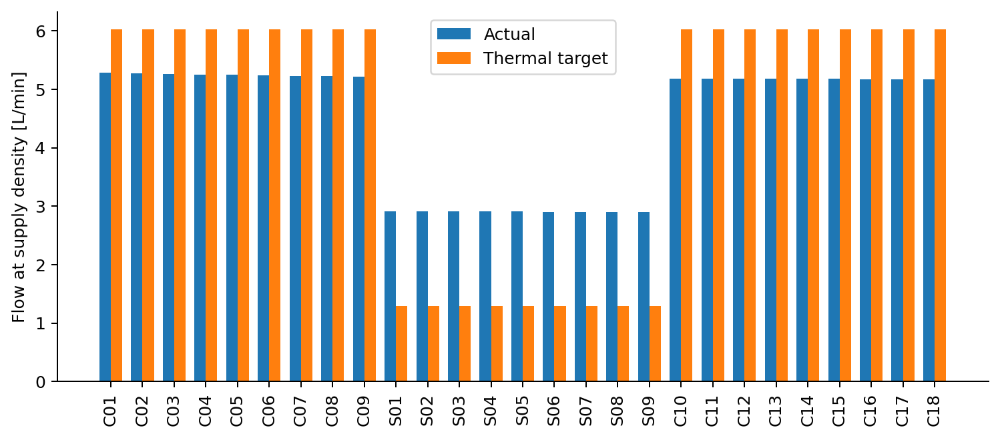

# XDU1350-like eight-rack extended loop

# Configuration
```yaml
name: XDU1350-like eight-rack extended loop
rack:
  compute_trays: 18
  switch_trays: 9
  layout:
  - C01
  - C02
  - C03
  - C04
  - C05
  - C06
  - C07
  - C08
  - C09
  - S01
  - S02
  - S03
  - S04
  - S05
  - S06
  - S07
  - S08
  - S09
  - C10
  - C11
  - C12
  - C13
  - C14
  - C15
  - C16
  - C17
  - C18
  elevations_m: null
  flow_LPM: 120
  supply_C: 38
  operating_mode: fixed_flow
  gravity_enabled: true
  gravity_m_s2: 9.80665
coolant:
  type: PG25
  property_file: /Users/jasonsimon/Desktop/Rack Manifold Optimization/data/coolant_properties.csv
  viscosity_multiplier: 1.0
power:
  gpu_W_each: 1200
  gpus_per_compute_tray: 4
  grace_cpu_W_each: 500
  cpus_per_compute_tray: 2
  switch_rack_total_W: 11160
  compute_fraction: 1.0
  switch_fraction: 1.0
  compute_aux_W: 0
  switch_aux_W: 0
  tray_heat_W: null
geometry:
  height_m: 1.8
  roughness_m: 1.5e-06
  supply:
    profile: constant
    inlet_m: 0.038
    outlet_m: 0.038
    exponent: 1.0
    pieces_m:
    - 0.038
    - 0.032
    - 0.025
  return:
    profile: constant
    inlet_m: 0.038
    outlet_m: 0.038
    exponent: 1.0
    pieces_m:
    - 0.025
    - 0.032
    - 0.038
branches:
  compute:
    diameter_m: 0.008
    tube_length_m: 1.5
    tube_multiplier: 1.0
    coldplate_K: 5500000.0
    qdc_K: 2300000.0
    restriction_K: 0.0
  switch:
    diameter_m: 0.006
    tube_length_m: 1.0
    tube_multiplier: 1.0
    coldplate_K: 20000000.0
    qdc_K: 5000000.0
    restriction_K: 0.0
  overrides: {}
loss_coefficients:
  header:
    tee: 0.08
    entrance: 0.2
    exit: 0.2
    reducer: 0.05
    expansion: 0.05
  branch:
    tee: 1.0
    entrance: 0.5
    exit: 1.0
    bend: 1.2
    fittings: 0.5
    valve: 0.3
    orifice: 0.0
external:
  enabled: true
  length_m: 12.0
  diameter_m: 0.04
  minor_K: 8.0
  equipment_K: 3000.0
cdu:
  mode: in_row
  reference: Vertiv XDU1350-like two pumps / eight identical racks
  capacity_W: 1368000
  nominal_flow_LPM: 1200
  available_dp_Pa: 244000
  approach_K: 4
  shutoff_dp_Pa: 330000
  speed: 1.0
  efficiency: 0.6
  served_racks: 8
  secondary_min_C: 10
  secondary_max_C: 52
  nominal_electric_W: 13700
facility:
  supply_C: 34
  flow_LPM: 1200
  coolant: water
  max_return_C: 60
  hx_model: rating_scaled
solver:
  pressure_tolerance_Pa: 0.05
  mass_relative_tolerance: 1.0e-08
  energy_relative_tolerance: 1.0e-08
  temperature_tolerance_K: 0.0001
  flow_relative_tolerance: 1.0e-06
  max_property_iterations: 60
  max_nfev: 200
  relaxation: 0.65
constraints:
  rack_flow_max_LPM: 130
  supply_max_C: 45
  return_max_C: 65
  branch_outlet_max_C: 65
  header_velocity_max_m_s: 3.0
  diameter_min_m: 0.015
  diameter_max_m: 0.05
  soft_penalty: 1000
coldplate:
  enabled: false
  channels: 100
  channel_width_m: 0.001
  channel_height_m: 0.001
  length_m: 0.08
  heated_area_m2: 0.03
  tim_K_W: 0.0002
  spreader_K_W: 0.0002
  plate_K_W: 0.0002
  laminar_Nu: 4.36
optimization:
  target: heat_proportional
  seed: 72
  maxiter: 35
  global_maxiter: 8
  population_size: 5
  normalization:
    temperature_K: 20
    pressure_Pa: 115000
    pump_W: 400
    volume_m3: 0.004
  weights:
    flow_error: 1.0
    temperature_spread: 0.05
    pressure: 0.02
    pump: 0.02
    size: 0.015
  bounds:
    diameter_m:
    - 0.025
    - 0.05
    taper_ratio:
    - 0.6
    - 1.0
    restriction_K:
    - 0.0
    - 200000000.0
    flow_LPM:
    - 90
    - 130
uncertainty:
  samples: 32
  seed: 720
  coldplate_multiplier:
  - 0.7
  - 1.3
  qdc_multiplier:
  - 0.7
  - 1.3
  tubing_multiplier:
  - 0.7
  - 1.3
  restriction_multiplier:
  - 0.7
  - 1.3
  compute_load_multiplier:
  - 0.75
  - 1.0
  switch_load_multiplier:
  - 0.8
  - 1.2
  supply_C:
  - 25
  - 45
  flow_LPM:
  - 90
  - 130
  viscosity_multiplier:
  - 0.9
  - 1.1
  coolants:
  - water
  - PG25
  roughness_m:
  - 1.0e-06
  - 5.0e-05
  efficiency:
  - 0.5
  - 0.8
plots:
  dpi: 180
```

# Source data
The retained `agent.md` is the primary source specification. Full categories, URLs, alternatives and every default are in `data/sources.yaml`.
| Input | Value | Category | Source |
| --- | --- | --- | --- |
| rack.compute_trays | 18 | NVIDIA | architecture |
| rack.switch_trays | 9 | NVIDIA | architecture |
| power.gpu_W_each | 1200 | NVIDIA | power |
| power.gpus_per_compute_tray | 4 | NVIDIA | architecture |
| power.grace_cpu_W_each | 500 | DERIVED | power |
| power.cpus_per_compute_tray | 2 | NVIDIA | architecture |
| power.switch_rack_total_W | 11160 | NVIDIA | switch |
| cdu.capacity_W | 121000 | OEM | cdu |
| cdu.nominal_flow_LPM | 120 | OEM | cdu |
| cdu.available_dp_Pa | 115000 | OEM | cdu |
| cdu.approach_K | 4 | OEM | cdu |
| cdu.nominal_electric_W | 875 | OEM | cdu |
| constraints.rack_flow_max_LPM | 130 | OEM | qct |
| constraints.supply_max_C | 45 | OEM | qct |
| constraints.return_max_C | 65 | OEM | qct |
| liquid_reference_W | 115560 | DERIVED | power |
| nominal_liquid_W | 102000 | DERIVED | architecture |
| HPE_rack_W | 132000 | OEM | agent.md |
| HPE_liquid_W | 115000 | OEM | agent.md |
| HPE_air_W | 17000 | OEM | agent.md |
| OCP_flow_clue_LPM | 5 | OCP | agent.md |
| GF_technical_loop_Pa | 232000 | 3P | gf |
| XDU1350_temperature_C | [10, 52] | OEM | agent.md |
| water_table | IAPWS97 at 0.1 MPa, 5 K grid | DERIVED | agent.md |
| inrow.cdu.capacity_W | 1368000 | OEM | Vertiv XDU1350, agent.md section 12 |
| inrow.cdu.nominal_flow_LPM | 1200 | OEM | Vertiv XDU1350, agent.md section 12 |
| inrow.cdu.available_dp_Pa | 244000 | OEM | Vertiv XDU1350, agent.md section 12 |
| inrow.cdu.secondary_min_C | 10 | OEM | Vertiv XDU1350, agent.md section 12 |
| inrow.cdu.secondary_max_C | 52 | OEM | Vertiv XDU1350, agent.md section 12 |
| inrow.cdu.nominal_electric_W | 13700 | OEM | Vertiv XDU1350, agent.md section 12 |

# Assumptions
All geometry, branch K values, minor-loss coefficients, pump shutoff, pump efficiency, facility conditions and workload capture factors are editable assumptions. PG25 40/50°C anchors are retained; other points are modeled extensions. The C09 omission in the source schematic is corrected to retain 27 trays.

# Baseline architecture
Constant 38 mm supply and return headers; direct return to bottom CDU ports; 18 compute and 9 switch paths, two resistance classes and no location balancing. This baseline is not claimed to be NVIDIA’s actual design.

# Hydraulic equations
`m_header[j] = sum(m_branch[j:])`; `Re = rho V D / mu`; `dp = (f L/D + K) rho V|V|/2`; `dp_component = K_hyd m|m|`. All branch loops and total rack flow solve simultaneously. Gravity enters each header as `rho g dz`; warm-return density leaves a small buoyancy term. Laminar f=64/Re; turbulent Haaland with continuous transition 2300–4000.

# Thermal equations
`h(T)=integral cp(T)dT`; `h_out = h_supply + Q/m`; `h_mix = sum(m h)/sum(m)`. The code analytically inverts the piecewise-linear cp integral. This is the variable-property extension of Q=m cp ΔT.

# CDU model
`dp_pump(q,N) = dp_shutoff N² - a q²`, with a fixed from the nominal point. `P_h=dp q`, `P_e=P_h/eta`. External head boundary excludes internal CDU losses.

# Baseline results / current design
| Metric | Value |
| --- | --- |
| M_flow | 0.5365143 |
| CV_flow | 0.244525 |
| M_thermal | 1.057263 |
| RMS_target_error | 0.7348774 |
| max_abs_target_error | 1.265243 |
| zero_load_flow_fraction | 0 |
| T_out_max_C | 53.96215 |
| T_out_min_C | 44.06221 |
| outlet_spread_K | 9.899933 |
| rack_dp_Pa | 80091.55 |
| system_dp_Pa | 111087 |
| rack_flow_LPM | 120 |
| heat_W | 115560 |
| T_return_C | 51.71964 |
| rack_deltaT_K | 13.71964 |
| pump_hydraulic_W | 222.1739 |
| pump_electrical_W | 370.2899 |
| header_volume_m3 | 0.004082814 |
| min_header_ID_m | 0.038 |
| max_header_ID_m | 0.038 |
| max_header_velocity_m_s | 1.775418 |
| resolved_fluid_volume_m3 | 0.005694451 |
| minimum_normalized_margin | 0 |

# Optimized results
See engineering_report.md for the executed baseline-versus-candidate study.

# Pressure-drop breakdown
| Component | Pa | kPa | % equivalent system head |
| --- | --- | --- | --- |
| coldplates | 44523.36 | 44.523 | 40.08 |
| qdcs | 16822.16 | 16.822 | 15.14 |
| tubing | 8640.77 | 8.641 | 7.78 |
| fittings | 6404.54 | 6.405 | 5.77 |
| valves | 457.47 | 0.457 | 0.41 |
| restrictions | 0.00 | 0.000 | 0.00 |
| header_friction | 826.36 | 0.826 | 0.74 |
| header_minor | 2354.11 | 2.354 | 2.12 |
| hydrostatic_net | 62.79 | 0.063 | 0.06 |
| external_piping | 8106.35 | 8.106 | 7.30 |
| external_fittings | 10379.76 | 10.380 | 9.34 |
| external_equipment | 12509.29 | 12.509 | 11.26 |



# Thermal distribution
| Tray | Heat W | Actual LPM | Target LPM | Outlet °C | Rise K |
| --- | --- | --- | --- | --- | --- |
| C01 | 5800.0 | 5.2856 | 6.0228 | 53.630 | 15.630 |
| C02 | 5800.0 | 5.2739 | 6.0228 | 53.664 | 15.664 |
| C03 | 5800.0 | 5.2633 | 6.0228 | 53.696 | 15.696 |
| C04 | 5800.0 | 5.2535 | 6.0228 | 53.725 | 15.725 |
| C05 | 5800.0 | 5.2447 | 6.0228 | 53.751 | 15.751 |
| C06 | 5800.0 | 5.2367 | 6.0228 | 53.775 | 15.775 |
| C07 | 5800.0 | 5.2295 | 6.0228 | 53.797 | 15.797 |
| C08 | 5800.0 | 5.2231 | 6.0228 | 53.816 | 15.816 |
| C09 | 5800.0 | 5.2175 | 6.0228 | 53.833 | 15.833 |
| S01 | 1240.0 | 2.9168 | 1.2876 | 44.062 | 6.062 |
| S02 | 1240.0 | 2.9142 | 1.2876 | 44.068 | 6.068 |
| S03 | 1240.0 | 2.9118 | 1.2876 | 44.073 | 6.073 |
| S04 | 1240.0 | 2.9096 | 1.2876 | 44.077 | 6.077 |
| S05 | 1240.0 | 2.9076 | 1.2876 | 44.081 | 6.081 |
| S06 | 1240.0 | 2.9057 | 1.2876 | 44.085 | 6.085 |
| S07 | 1240.0 | 2.9040 | 1.2876 | 44.089 | 6.089 |
| S08 | 1240.0 | 2.9025 | 1.2876 | 44.092 | 6.092 |
| S09 | 1240.0 | 2.9011 | 1.2876 | 44.095 | 6.095 |
| C10 | 5800.0 | 5.1822 | 6.0228 | 53.941 | 15.941 |
| C11 | 5800.0 | 5.1803 | 6.0228 | 53.947 | 15.947 |
| C12 | 5800.0 | 5.1789 | 6.0228 | 53.951 | 15.951 |
| C13 | 5800.0 | 5.1777 | 6.0228 | 53.955 | 15.955 |
| C14 | 5800.0 | 5.1769 | 6.0228 | 53.957 | 15.957 |
| C15 | 5800.0 | 5.1762 | 6.0228 | 53.959 | 15.959 |
| C16 | 5800.0 | 5.1758 | 6.0228 | 53.961 | 15.961 |
| C17 | 5800.0 | 5.1755 | 6.0228 | 53.962 | 15.962 |
| C18 | 5800.0 | 5.1753 | 6.0228 | 53.962 | 15.962 |



# Pump requirements
Rack 80.092 kPa; system 111.087 kPa; hydraulic 222.17 W; electrical 370.29 W.

# Facility-loop compatibility
| Quantity | Value |
| --- | --- |
| FWS_return_C | 45.1244409339177 |
| FWS_supply_C | 34 |
| approach_K | 4.0 |
| HX_available_W_per_rack | 136800.0 |
| effectiveness_required | 0.7742617336571341 |
| hot_end_pinch_K | 6.59519546093486 |
| model | conservative rating scaling by cold-end approach and TCS capacity rate; no vendor UA map |
| aggregate_heat_W | 924480.0 |

# Uncertainty analysis
See uncertainty.csv and engineering_report.md for paired baseline/candidate draws, worst sampled outcomes and feasibility rates. A nominal pass alone does not establish robustness.

# Constraint margins
Overall: **PASS**
| Constraint | Margin | Units | Pass |
| --- | --- | --- | --- |
| CDU_external_head | 132913 | Pa | True |
| pump_curve | 163873 | Pa | True |
| rack_flow | 10 | LPM | True |
| CDU_aggregate_flow | 240 | LPM | True |
| supply_temperature | 7 | K | True |
| return_temperature | 13.2804 | K | True |
| branch_outlet | 11.0379 | K | True |
| minimum_thermal_flow | 0.0360719 | kg/s | True |
| header_velocity | 1.22458 | m/s | True |
| minimum_diameter | 0.023 | m | True |
| maximum_diameter | 0.012 | m | True |
| HX_capacity | 21240 | W | True |
| HX_approach | 0 | K | True |
| HX_hot_pinch | 6.5952 | K | True |
| FWS_return | 14.8756 | K | True |
| CDU_secondary_max_temperature | 0.280364 | K | True |
| CDU_secondary_min_temperature | 28 | K | True |

# Validation
| Check | Result |
| --- | --- |
| mass_relative_error | 2.1747757583254778e-16 |
| energy_relative_error | 2.392578654715907e-15 |
| pressure_residual_Pa | 4.3655745685100555e-11 |
| property_iterations | 11 |
| nfev | 377 |
| temperature_error_K | 7.137914860777528e-05 |
| flow_relative_error | 3.0938916964339066e-08 |
| converged | True |

# Improvement over baseline
The executed comparison is in engineering_report.md; no proprietary manifold comparison is implied.

# Limitations
This is an NVL72-class engineering model, not a reverse-engineered NVIDIA rack. Exact header dimensions/taper, cold-plate pressure curves, QDC Cv, internal tray plumbing, liquid heat-capture fraction, workload and installed pump curves are unavailable here. Component losses and PG25 property extensions require measurements for design qualification.

The header is a one-dimensional dissipative static-pressure network. It includes Darcy and configured junction losses but neglects recoverable axial kinetic-head redistribution and three-dimensional tee momentum effects. Diameter profiles are discretized into one segment per branch. Headers are adiabatic. Branch reduced K is fixed versus mass flow; viscosity dependence enters resolved tubing/headers, not an unmeasured cold-plate curve. This limitation is included in resistance uncertainty.

Resolved fluid volume includes headers and configured branch tubes; unmeasured QDC and reduced-model cold-plate inventory is excluded. Pressures are relative to the CDU return, not absolute pressure. No cavitation, boiling, transient control, corrosion or structural qualification is inferred. Final return mixing uses enthalpy. Flow in L/min is referenced to supply density; local return volume flow differs. The pressure budget is the mass-flow-weighted equivalent of complete branch paths, including signed buoyancy head, not a sum of parallel pressure drops. Pump power uses inlet volume flow and ignores small thermal expansion corrections and internal CDU overhead. Rated CDU power is separately recorded.

The pump parabola uses one published rating and an assumed shutoff; it is not a measured manufacturer curve. Fixed-flow operation assumes speed control/throttling is available. The HX screen derates its nominal capacity with approach and TCS heat-capacity rate and checks both terminal pinches and facility heat balance; this is not a vendor UA/performance map. XDU1350 is represented by identical parallel racks, not a solved row distribution network. Its temperature range is conservatively checked at both secondary ends.

The optional channel model predicts an equivalent tray-level chip temperature using assumed area and resistances, not 72 individual GPU temperatures. Local optimization success and global iteration-budget termination are reported separately; a feasible candidate is not a certified global optimum. Monte Carlo extrema cover the sampled parameter range only, and the assumed uniform distributions are not measured reliability probabilities.

# Conclusions
This candidate passes the configured nominal engineering screen.
